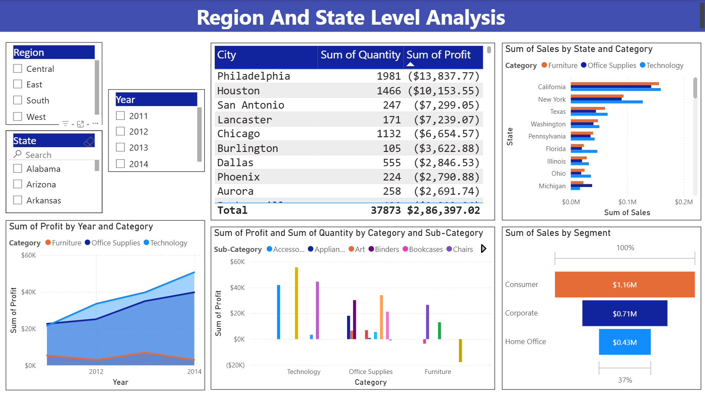
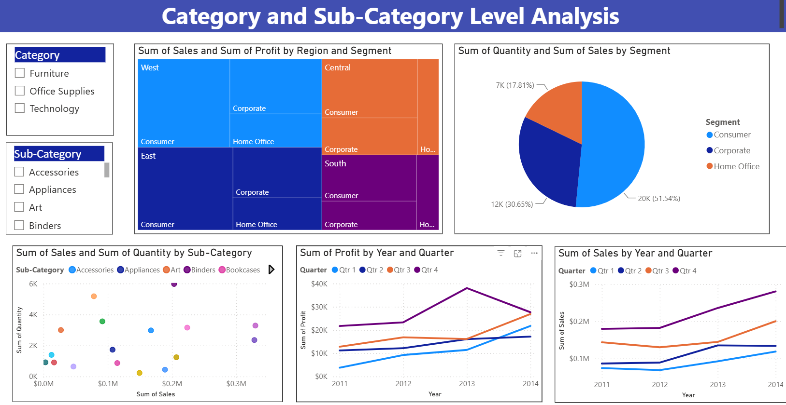

# Sales-Dashboard
# 📊 Sales Dashboard

## 📌 Project Overview

The **Sales Dashboard** is an interactive Power BI project designed to analyze sales performance, profitability, quantity sold, customer segments, regions, states, categories, and sub-categories.

The dashboard transforms sales data into meaningful visual insights to help understand business performance and identify profitable and underperforming areas.

---

## 🎯 Objectives

- Analyze overall sales and profit performance
- Track total revenue and quantity sold
- Analyze sales and profit trends over the years
- Compare performance across regions and states
- Analyze sales by category and sub-category
- Understand customer segment performance
- Identify profitable and loss-making areas
- Provide interactive filtering for better analysis

---

## 🛠️ Tools & Technologies

- **Power BI**
- **Power Query**
- **DAX**
- **Microsoft Excel**
- **Data Visualization**
- **Data Cleaning & Transformation**

---

## 📊 Dashboard Pages

### 1. Dashboard Overview

The main dashboard provides an overall view of:

- Total Revenue
- Total Profit
- Total Quantity Sold
- Shipping Cost
- Sales & Profit by Year
- Sales by Year and Quarter
- Sales & Profit by Segment
- Sales & Profit by Category
- Order Date filtering

---

### 2. Region & State Level Analysis

This page focuses on geographical and regional performance.

It includes:

- Region-wise analysis
- State-wise sales analysis
- City-wise quantity and profit
- Sales by State and Category
- Profit by Year and Category
- Sales by Customer Segment
- Category and sub-category analysis

---

### 3. Category & Sub-Category Analysis

This page provides detailed product-level analysis.

It includes:

- Category filtering
- Sub-category filtering
- Sales and Profit by Region and Segment
- Quantity by Customer Segment
- Sales and Quantity by Sub-Category
- Profit by Year and Quarter
- Sales by Year and Quarter

---

## 📈 Key KPIs

| KPI | Value |
|---|---:|
| Total Revenue | $2.3M |
| Total Profit | $286.4K |
| Total Quantity Sold | 38K |
| Shipping Cost | $238.17K |

---

## 🔍 Key Insights

- Total sales generated were approximately **$2.3M**.
- Total profit was approximately **$286.4K**.
- Around **38K units** were sold.
- The **Consumer segment** contributes the largest share of sales.
- **Technology** is the highest-performing category by sales.
- Sales increased significantly toward **2014**.
- The dashboard allows users to analyze performance at region, state, city, category and sub-category levels.

---

## 🎛️ Interactive Features

The dashboard includes interactive filters and slicers for:

- Order Date
- Region
- State
- Year
- Category
- Sub-Category

These filters allow users to explore the data from different perspectives.

## Screenshorts
example- 1[Dashboard Preview1](https://github.com/drashtish10-DS/Sales-Dashboard/blob/main/Sales%20Overview.png)
2[Dashboard preview2](https://github.com/drashtish10-DS/Sales-Dashboard/blob/main/Region_State_Analysis.png)
3[Dashboard preview3](https://github.com/drashtish10-DS/Sales-Dashboard/blob/main/Category_Subcategory_Analysis.png)

